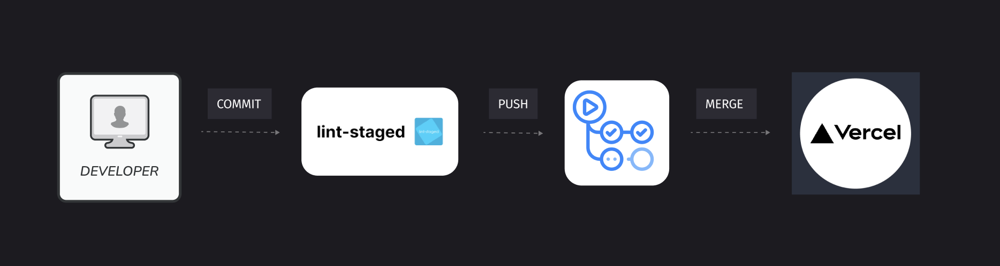
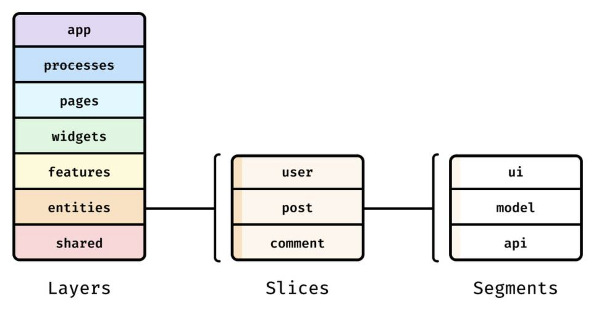
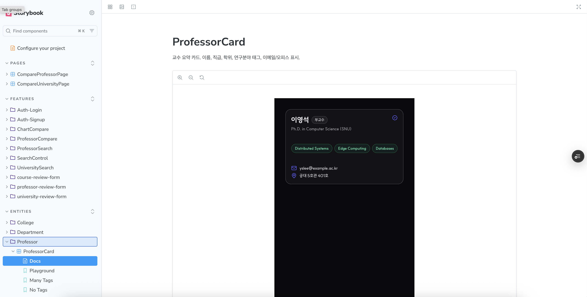

<br>
<p align="center">
  
</p>

<br>

## 한국형 RateMyProfessor — 전국 모든 대학 정보를 한눈에

> **전국 모든 대학의 강의·교수·학교 정보를 제공하는 통합 플랫폼**  
> 학생들이 직접 남긴 리뷰를 기반으로 강의 선택과 대학 비교를 돕는 서비스

## 📝 서비스 소개

> “한눈에 비교하고, 믿을 수 있는 데이터를 기반으로 선택하세요.”

**UniScope**는 대학 생활의 모든 순간에 필요한 정보를 제공합니다.  
학점 교류를 고민하는 대학생, 대학원 진학을 고려하는 대학생,  
그리고 대입을 준비하는 고등학생까지 -  
모두가 더 나은 선택을 할 수 있도록 돕는 **대학 정보 통합 플랫폼**입니다.

해외에는 이미 **RateMyProfessor** 등  
학생들이 직접 강의와 교수를 평가하고 공유하는 플랫폼이 활발히 운영되고 있습니다.  
하지만 국내에서는 이러한 통합 플랫폼이 없고, 정보가 파편화되어 있습니다.

**UniScope**는 그 공백을 메우기 위해 시작되었습니다.  
학생들이 더 객관적이고, 더 나은 선택을 할 수 있도록 돕습니다.

## ✨ 주요 기능 (요약)

### 🏠 메인 페이지 : 대학명, 학과명, 교수명으로 통합 검색을 지원합니다.


### 🏫 대학 페이지 : 대학 리뷰, 단과대학 정보, 연락처 정보를 제공합니다.


### 🎓️ 교수 페이지 : 담당 교과목, 평가, 연구실 정보를 제공합니다.


### 🔍 비교 페이지 : 학교 비교, 교수 비교 기능을 제공합니다.


## 🧩 아키텍처와 팀 규칙

### 1. ♾️ CI/CD 파이프라인



코드는 **로컬 훅(Husky) → CI (GitHub Actions) → PR → Vercel 배포** 단계로 안정적으로 전달됩니다.

- **GitHub Actions 기반 완전 자동화 배포 파이프라인**  
  브랜치 푸시 또는 PR 생성 시 자동으로 테스트, 빌드, 린트 검사가 수행됩니다.

- **Vercel 정적 사이트 배포**  
  글로벌 CDN을 통해 빠르고 안정적인 배포 환경을 제공합니다.

- **PR 단위 품질 관리**
  - **Husky + lint-staged** — 커밋 단계에서 ESLint / Prettier / TypeCheck 사전 검증
  - **팀원 간 상호 코드 리뷰** — 코드 품질 향상 및 일관성 유지
  - **테스트 자동 실행** — 배포 전 단계에서 품질 보장

### 2. 🔼 Feature-Sliced-Design 아키텍처



**FSD(Feature-Sliced Design)** 를 기반으로 기능 단위로 책임을 분리하고,
레이어 간 **단방향 의존성**을 강제하여 확장성과 유지보수성을 극대화합니다.

#### 레이어 개요 (상→하 의존)

```
app      → 앱 진입점 및 전역 설정 (Provider, Router, Layout)
pages    → 페이지 조립 (도메인 UI 조합 + 라우팅 연결)
features → 사용자 인터랙션 / 비즈니스 로직 (폼, 플로우, 비교 등)
entities → 도메인 모델 / 훅 / 맵퍼 / API / UI (엔티티 중심)
shared   → 공통 유틸 / UI
```

> **의존성 규칙:** `shared → entities → features → pages → app` (역참조 금지!)

#### 관련 팀 규칙 (UniScope FSD Guideline)

##### 1) `index.ts` 규칙

- 각 레이어/도메인 루트에 **반드시 `index.ts` 생성**.
- **외부 모듈은 `index.ts`만 import**(내부 경로 직접 접근 금지).
- 외부 노출 대상 최소화(캡슐화) — 내부 파일은 export 하지 않음.

##### 2) 네이밍 컨벤션

- 디렉토리: `kebab-case` (`professor-review-form`)
- React 컴포넌트 파일: `PascalCase.tsx`
- 기능 슬라이스: 동사+명사 (`univ-compare`, `search-control`)

##### 3) pages / widgets 규칙

- `pages/`와 `widgets/` 폴더 하위에는 `ui/`와 `index.ts`만 둔다.
- 비즈니스 로직(`model`, `api`, 상태, 매핑)은 해당 책임 레이어에 배치.

##### 4) 상태 관리 규칙

- 전역 상태: `app/providers/`의 `React Context`로 제공.
- 도메인/피처 상태: 해당 레이어 내부에 co-locate.

##### 5) 텍스트 / 상수 분리 규칙

- 사용자 노출 텍스트: 각 도메인 text.ts에 중앙화.
- UI 컴포넌트에 하드코딩 금지.
- 재사용 상수/enum은 shared/lib 또는 shared/types에 배치.

##### 6) type / model 규칙

- 로컬 전용 타입 / Props: 해당 기능 폴더에 co-locate.
- API request/response/domain/view-model 명확 분리 (`*.request.ts`, `*.response.ts`, `*.domain.ts`).
- map.ts(또는 \*.map.ts)에서 DTO ↔ Domain 매핑만 담당.

##### 7) 커밋 / PR 규칙

- Conventional Commits: feat:, fix:, refactor:, docs:, test:, chore: (AngularJS Commit Convention 사용)
- 작은 PR 유지(가급적 400라인 이하), 하나의 의도만 담기.
- PR 템플릿: `.github/PULL_REQUEST_TEMPLATE.md`

##### 8) 일정 관리 규칙

- `github issue` 대신 자체 `Notion ISSUE TRACKER` 사용.
- https://maize-buzzard-1ac.notion.site/268078a84c0d8021aa2ddaa7c3edda83?v=268078a84c0d8104b400000c6d6ba676

##### 9) 디자인 시스템 규칙

- **shadcn** 기반의 커스텀 디자인 시스템을 사용.
- `shared/ui`에는 **원자(atomic) 단위의 컴포넌트만** 배치하며, 도메인 의미가 포함된 컴포넌트는 **`entities` 또는 `features`** 레이어에 배치.
- **YAGNI** 원칙을 따른다.  
  즉, _“지금 당장 필요하지 않은 추상화나 컴포넌트 분리는 하지 않는다.”_  
  불필요한 추상화는 복잡도만 증가시키며,  
  실제 재사용 시점이 올 때 명확한 요구사항에 맞춰 분리하는 것을 원칙으로 한다.

### 3. 📖 Storybook 기반 컴포넌트 문서화



모든UI 컴포넌트는 **Storybook**을 통해 문서화되고,  
디자인 시스템과 상호 작용을 테스트할 수 있도록 관리됩니다.

- **자동 문서화** — 코드 변경 시 Storybook Docs가 자동 갱신되어 개발자·디자이너 간 커뮤니케이션 효율 향상
- **반응형 뷰포트 테스트** — 다양한 디바이스 해상도에서 컴포넌트 UI 검증 가능

### 4. 🧪 E2E 테스트 (Playwright)

**Playwright**를 활용하여 실제 사용자 플로우를 검증하는 E2E 테스트를 구축했습니다.

- **API 연동 테스트** — 실제 API 호출과 응답을 검증하여 백엔드 통합 확인
- **크로스 브라우저 테스트** — GitHub Actions matrix 전략으로 Chromium, Firefox, WebKit에서 병렬 실행
- **리팩토링 친화적** — Semantic Selector(`getByRole`, `getByText`) 사용으로 HTML 구조 변경 테스트
- **자동화된 CI/CD** — PR 생성 시 자동으로 E2E 테스트 실행 및 실패 시 관련 스크린샷 업로드

자세한 내용은 [E2E 테스트 가이드](./e2e/README.md)를 참고.

## 🔧 기술 스택

| 분야                           | 기술 스택                                                    |
| :----------------------------- | :----------------------------------------------------------- |
| **Frontend**                   | React 19 · TypeScript · Vite · React Router · TanStack Query |
| **UI / Design System**         | shadcn/ui · Tailwind CSS · Lucide Icons                      |
| **Form & Validation**          | React Hook Form · Zod                                        |
| **Chart / Data Visualization** | Recharts(shadcn)                                             |
| **Code Quality / Test**        | ESLint · Prettier · Vitest(Unit) · Playwright(E2E)           |
| **Docs / Collaboration**       | Storybook · Chromatic · Husky · lint-staged                  |
| **CI / CD**                    | GitHub Actions · Vercel (Preview & Production Deploy)        |
