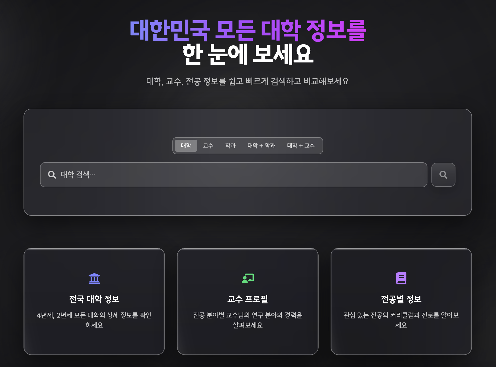
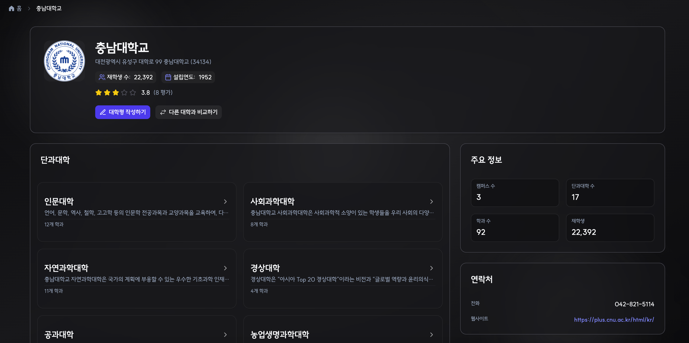
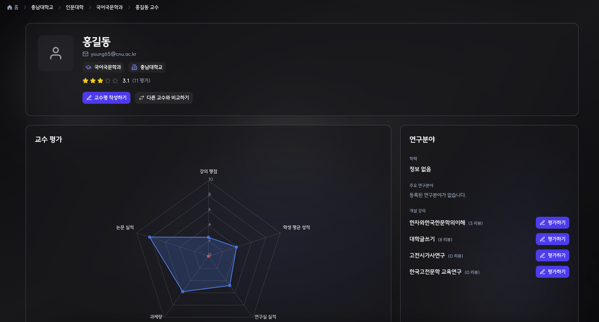
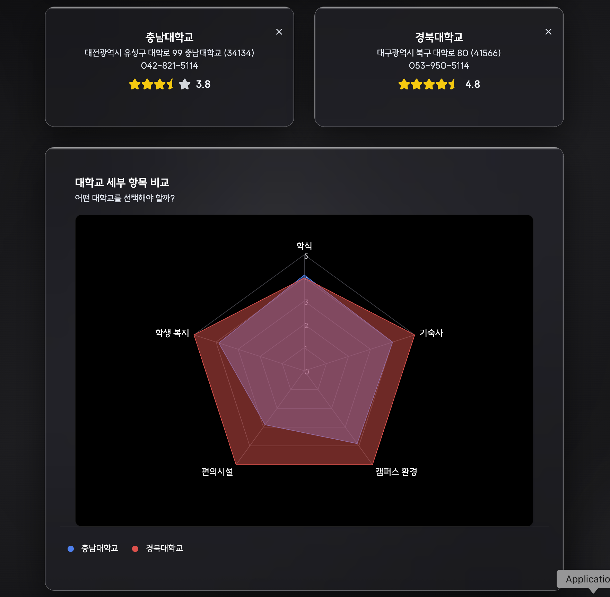

 

  

 

## 한국형 RateMyProfessor — 전국 모든 대학 정보를 한눈에

> **전국 모든 대학의 강의·교수·학교 정보를 제공하는 통합 플랫폼**  
> 학생들이 직접 남긴 리뷰를 기반으로 강의 선택과 대학 비교를 돕는 서비스

## 📝 서비스 소개

> “한눈에 비교하고, 믿을 수 있는 데이터를 기반으로 선택하세요.”

**UniScope**는 대학 생활의 모든 순간에 필요한 정보를 제공합니다.  
학점 교류를 고민하는 대학생, 대학원 진학을 고려하는 대학생,  
그리고 대입을 준비하는 고등학생까지 -  
모두가 더 나은 선택을 할 수 있도록 돕는 **대학 정보 통합 플랫폼**입니다.

해외에는 이미 **RateMyProfessor** 등  
학생들이 직접 강의와 교수를 평가하고 공유하는 플랫폼이 활발히 운영되고 있습니다.  
하지만 국내에서는 이러한 통합 플랫폼이 없고, 정보가 파편화되어 있습니다.

**UniScope**는 그 공백을 메우기 위해 시작되었습니다.  
학생들이 더 객관적이고, 더 나은 선택을 할 수 있도록 돕습니다.

## ✨ 주요 기능 (요약)

### 🏠 메인 페이지 : 대학명, 학과명, 교수명으로 통합 검색을 지원합니다.

### 🏫 대학 페이지 : 대학 리뷰, 단과대학 정보, 연락처 정보를 제공합니다.

### 🎓️ 교수 페이지 : 담당 교과목, 평가, 연구실 정보를 제공합니다.

### 🔍 비교 페이지 : 학교 비교, 교수 비교 기능을 제공합니다.

## 🧩 아키텍처와 팀 규칙

### 0. 전체 아키텍처

[Overall System Architecture](https://github.com/kakao-tech-campus-3rd-step3/Team21_FE/wiki/Overall-System-Architecture)

### 1. CI/CD 파이프라인

[Frontend CI-CD Pipeline](https://github.com/kakao-tech-campus-3rd-step3/Team21_FE/wiki/Frontend-CI-CD-Pipeline)

### 2. Feature-Sliced-Design 아키텍처

[FSD Architecture](https://github.com/kakao-tech-campus-3rd-step3/Team21_FE/wiki/FSD-Architecture)

#### 관련 팀 규칙 (UniScope FSD Guideline)

[UniScope FSD Guideline (Team Rule)](<https://github.com/kakao-tech-campus-3rd-step3/Team21_FE/wiki/UniScope-FSD-Guideline-(Team-Rule)>)

### 3. Storybook 기반 컴포넌트 문서화

[Storybook 기반 컴포넌트 문서화](https://github.com/kakao-tech-campus-3rd-step3/Team21_FE/wiki/Storybook-%EA%B8%B0%EB%B0%98-%EC%BB%B4%ED%8F%AC%EB%84%8C%ED%8A%B8-%EB%AC%B8%EC%84%9C%ED%99%94)

### 4. E2E 테스트 (Playwright)

[e2e Test](https://github.com/kakao-tech-campus-3rd-step3/Team21_FE/wiki/e2e-Test)

### 5. SEO 최적화

[SEO](https://github.com/kakao-tech-campus-3rd-step3/Team21_FE/wiki/Lighthouse)

## 🔧 기술 스택

| 분야                           | 기술 스택                                                    |
| :----------------------------- | :----------------------------------------------------------- |
| **Frontend**                   | React 19 · TypeScript · Vite · React Router · TanStack Query |
| **UI / Design System**         | shadcn/ui · Tailwind CSS · Lucide Icons                      |
| **Form & Validation**          | React Hook Form · Zod                                        |
| **Chart / Data Visualization** | shadcn/ui(RadixUI)                                           |
| **Code Quality / Test**        | ESLint · Prettier · Vitest(Unit) · Playwright(E2E)           |
| **Docs / Collaboration**       | Storybook · Husky · lint-staged                              |
| **CI / CD**                    | GitHub Actions · Vercel (Preview & Production Deploy)        |
